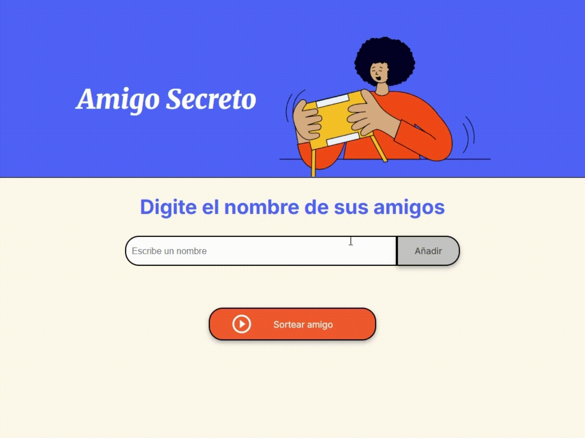

Una aplicación web interactiva para organizar sorteos de amigo secreto de manera sencilla y divertida.

## Descripción del Proyecto

El Challenge de Amigo Secreto de Alura es un desafío en el que el tuve que implementar las funcionalidades de Javascript para una aplicación web que permite a los usuarios ingresar nombres de participantes y realizar un sorteo aleatorio para seleccionar a un "amigo secreto". La aplicación cuenta con una interfaz amigable y responsive proporcionada por Alura, diseñada para ser intuitiva y fácil de usar. 

## Características Principales

- **Agregar Participantes**: Permite ingresar nombres de participantes uno por uno.
- **Validación de Entrada**: Verifica que no se ingresen nombres vacíos.
- **Lista Dinámica**: Muestra en tiempo real la lista de participantes agregados.
- **Sorteo Aleatorio**: Selecciona un participante al azar de la lista.
- **Experiencia de Usuario Mejorada**: Incluye funcionalidades como limpieza automática del campo de texto y enfoque después de agregar un nombre.

## Tecnologías Utilizadas

- **HTML5**: Estructura semántica para el contenido.
- **CSS3**: Estilos modernos con variables CSS para una apariencia consistente.
- **JavaScript**: Lógica de la aplicación para manejar la interactividad.

## Implementación JavaScript

La funcionalidad principal de la aplicación está implementada en JavaScript (`app.js`), que incluye las siguientes características:

- **Gestión de datos**: Almacenamiento de nombres en un array.
- **Agregar participante**: Validación de entrada y actualización de la lista.
- **Actualizar lista visible**: Renderizado dinámico de la lista de participantes.
- **Sorteo aleatorio**: Selección aleatoria de un participante de la lista.
- **Manejo de eventos**: Soporte para agregar participantes con la tecla Enter.
- **Experiencia de usuario**: Limpieza automática del campo y enfoque después de agregar un nombre.

## Demostración

A continuación se muestra un video de demostración de validaciones, cómo agregar nombres y realizar el sorteo:

## Uso

1. Accede a la aplicación a través de GitHub Pages: https://ldp33.github.io/challenge-amigo-secreto_alura/
2. Alternativamente, puedes clonar este repositorio y abrir el archivo `index.html` en tu navegador web.
3. ¡Comienza a agregar nombres y realiza el sorteo!

## Posibles Mejoras Futuras

- Implementar la funcionalidad de asignación de parejas para un verdadero amigo secreto.
- Agregar la opción de eliminar nombres de la lista.
- Permitir guardar y cargar listas de participantes.
- Implementar animaciones durante el sorteo para mayor emoción.

## Autor

Desarrollado por Leandro Pollano como parte del curso de ONE (Oracle Next Education).